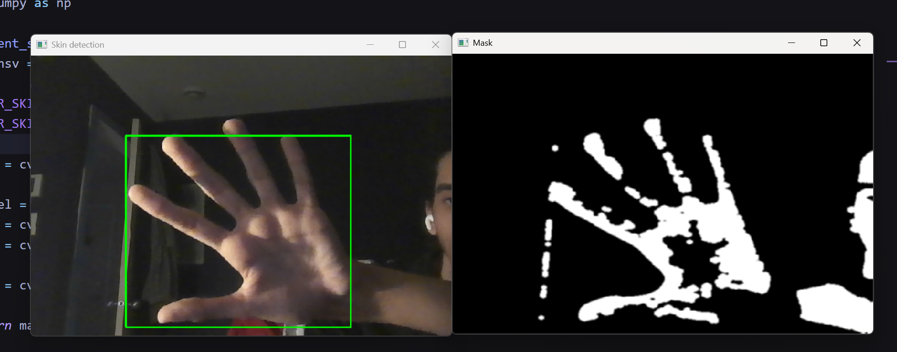
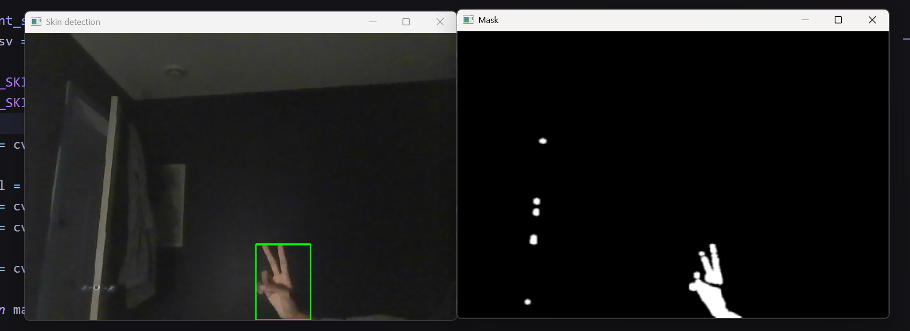
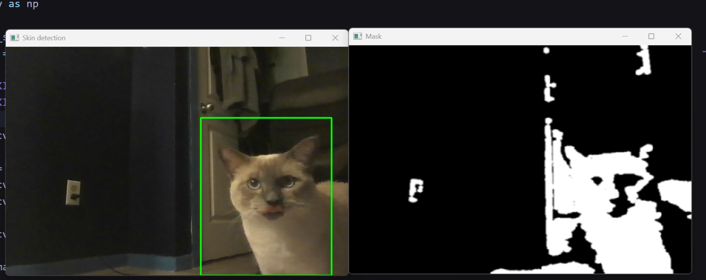

# Real-Time Skin Detection

A real-time skin detection system that uses color segmentation techniques to identify and track skin regions from webcam input. The system processes video frames by converting them to HSV color space, applying skin color filtering, cleaning the mask, and drawing bounding boxes around detected skin areas.

## Previews

### Detection Results


*Example of successful skin detection with bounding box overlay with binary mask*


*Works even if its far*


*Works with cats*

## Features

- **Real-time processing**: Live webcam feed processing
- **Skin color segmentation**: HSV-based color filtering for skin detection
- **Noise reduction**: Morphological operations to clean detection masks
- **Contour analysis**: Automatic detection of the largest skin region
- **Bounding box visualization**: Rectangle overlay on detected skin areas
- **Dual window display**: Original feed and processed mask visualization

## Requirements

- Python 3.7+
- OpenCV
- NumPy
- Webcam/Camera

## Installation

1. Clone the repository:

```bash
git clone https://github.com/ben4ali/real-time-hand-detection.git
cd real-time-hand-detection
```

1. Install dependencies:

```bash
pip install -r requirements.txt
```

## Usage

Run the main script to start real-time skin detection:

```bash
python main.py
```

- Press `ESC` to exit the application
- Two windows will appear:
  - **Skin detection**: Original video with bounding box overlay
  - **Mask**: Processed binary mask showing detected skin regions

## Algorithm Steps

The skin detection pipeline consists of several key steps:

### 1. Color Space Conversion (BGR to HSV)

The input frame is converted from BGR (Blue-Green-Red) to HSV (Hue-Saturation-Value) color space. HSV is more suitable for color-based segmentation as it separates chrominance information from luminance, making it less sensitive to lighting variations.

```python
img_hsv = cv2.cvtColor(frame_bgr, cv2.COLOR_BGR2HSV)
```

### 2. Skin Color Masking

A binary mask is created by filtering pixels within a specific HSV range that corresponds to human skin tones:

- **Lower bound**: `[0, 30, 80]` (Hue: 0°, Saturation: 30, Value: 80)
- **Upper bound**: `[50, 150, 255]` (Hue: 50°, Saturation: 150, Value: 255)

```python
LOWER_SKIN = np.array([0, 30, 80], dtype=np.uint8)
UPPER_SKIN = np.array([50, 150, 255], dtype=np.uint8)
mask = cv2.inRange(img_hsv, LOWER_SKIN, UPPER_SKIN)
```

### 3. Noise Cleaning and Morphological Operations

The binary mask is cleaned using morphological operations to remove noise and fill gaps:

- **Erosion**: Removes small noise pixels and thin connections
- **Dilation**: Restores the size of the main objects and fills small holes
- **Gaussian Blur**: Smooths the mask edges

```python
kernel = cv2.getStructuringElement(cv2.MORPH_ELLIPSE, (5,5))
mask = cv2.erode(mask, kernel, iterations=2)
mask = cv2.dilate(mask, kernel, iterations=2)
mask = cv2.GaussianBlur(mask, (5,5), 0)
```

### 4. Contour Detection and Selection

All contours in the cleaned mask are found, and the largest one (by area) is selected as the primary skin region:

```python
contours, _ = cv2.findContours(mask, cv2.RETR_EXTERNAL, cv2.CHAIN_APPROX_SIMPLE)
largest_contour = max(contours, key=cv2.contourArea)
```

### 5. Bounding Rectangle Application

A bounding rectangle is drawn around the largest contour to highlight the detected skin area:

```python
x, y, w, h = cv2.boundingRect(contour)
cv2.rectangle(image, (x, y), (x + w, y + h), (0, 255, 0), 2)
```